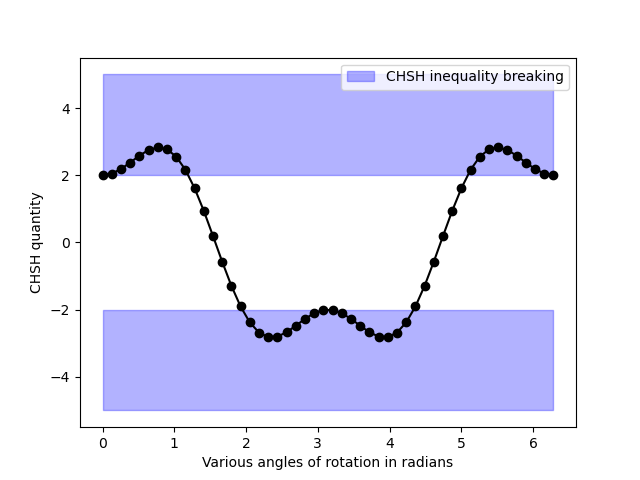

[](LICENSE)
[](https://www.python.org)

# CHSH Bell Inequality Violation – Quantum Nonlocality Demo



**Maximum quantum value: 2√2 ≈ 2.828**  
**Classical theories cannot exceed ±2**  
**Quantum mechanics violates the CHSH inequality by 41 %**

A clean, minimal, fully-working demonstration of the famous CHSH Bell inequality violation using QuTiP.

The plot shows dramatically how quantum entanglement produces correlations impossible for any local realistic theory.


## Quick Start

```bash
git clone https://github.com/yourusername/CHSH-Bell-Violation.git
cd CHSH-Bell-Violation
pip install -r requirements.txt
python chsh_violation.py
